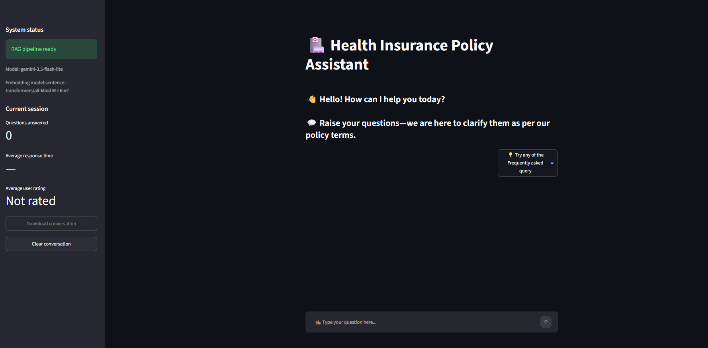
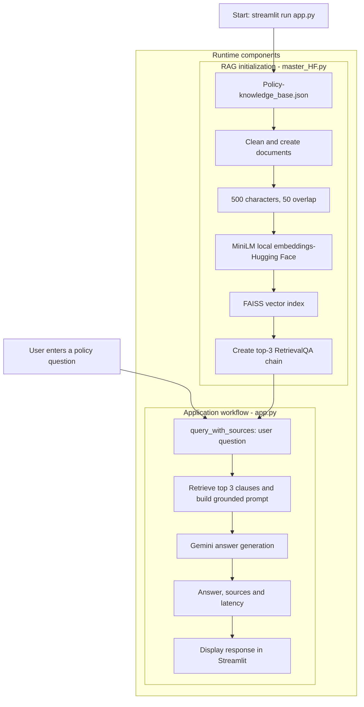
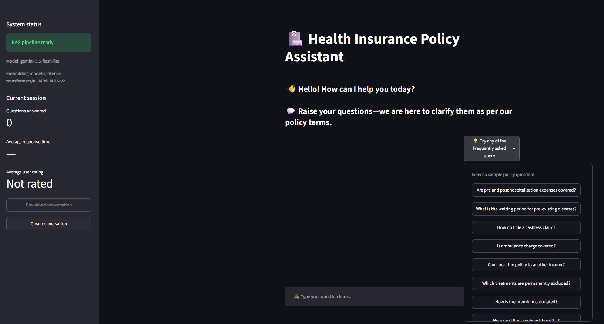
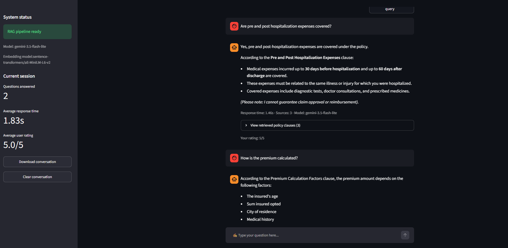

# Health Insurance Policy Assistant — RAG with Gemini, Hugging Face and FAISS

[](https://www.python.org/)
[](https://streamlit.io/)
[](https://www.langchain.com/)
[](https://ai.google.dev/)
[](https://huggingface.co/sentence-transformers/all-MiniLM-L6-v2)
[](https://github.com/facebookresearch/faiss)
[](https://docs.ragas.io/)
[](#project-status)

A source-grounded conversational assistant that retrieves relevant health-insurance policy clauses and uses Gemini to generate simple, policy-aware answers. The project combines a local Hugging Face embedding model, FAISS similarity search, LangChain orchestration, a Streamlit chat interface, optional LangSmith tracing, and an evaluation suite covering answer quality, retrieval, latency, groundedness, hallucination and estimated production cost.

<p align="center">
  
</p>

> **Portfolio highlight:** The embedding layer was migrated from a paid hosted embedding API to local `all-MiniLM-L6-v2` embeddings, eliminating per-query embedding API cost while retaining semantic FAISS retrieval.

## Table of contents

- [Health Insurance Policy Assistant — RAG with Gemini, Hugging Face and FAISS](#health-insurance-policy-assistant--rag-with-gemini-hugging-face-and-faiss)
  - [Table of contents](#table-of-contents)
  - [Project objective](#project-objective)
  - [Key features](#key-features)
  - [Business applications](#business-applications)
  - [Technology stack](#technology-stack)
  - [System architecture](#system-architecture)
  - [Seven-stage RAG pipeline](#seven-stage-rag-pipeline)
  - [Techniques used](#techniques-used)
    - [Data preparation](#data-preparation)
    - [Retrieval](#retrieval)
    - [Generation and grounding](#generation-and-grounding)
    - [Application design](#application-design)
    - [Evaluation](#evaluation)
  - [Project structure](#project-structure)
  - [File descriptions](#file-descriptions)
  - [Installation](#installation)
    - [Prerequisites](#prerequisites)
    - [Windows PowerShell setup](#windows-powershell-setup)
  - [Configuration](#configuration)
  - [Execution order](#execution-order)
    - [1. Verify the core pipeline](#1-verify-the-core-pipeline)
    - [2. Start the Streamlit chatbot](#2-start-the-streamlit-chatbot)
    - [3. Smoke-test the evaluator](#3-smoke-test-the-evaluator)
    - [4. Run the complete evaluation](#4-run-the-complete-evaluation)
  - [Evaluation framework](#evaluation-framework)
    - [Hallucination reporting](#hallucination-reporting)
  - [Latest evaluation results](#latest-evaluation-results)
    - [Result interpretation](#result-interpretation)
    - [Evaluation integrity note](#evaluation-integrity-note)
  - [Streamlit application](#streamlit-application)
    - [Suggested questions](#suggested-questions)
    - [Application screenshots](#application-screenshots)
      - [Home screen and system status](#home-screen-and-system-status)
      - [Frequently asked questions](#frequently-asked-questions)
      - [Grounded answers, sources and feedback](#grounded-answers-sources-and-feedback)
  - [Cost optimization](#cost-optimization)
  - [Monitoring and observability](#monitoring-and-observability)
  - [Knowledge base](#knowledge-base)
  - [Limitations](#limitations)
  - [Troubleshooting](#troubleshooting)
    - [`GEMINI_API_KEY not found`](#gemini_api_key-not-found)
    - [LangSmith tracing shows disabled](#langsmith-tracing-shows-disabled)
    - [`HealthInsuranceRAG` has no `embedding_model_name`](#healthinsurancerag-has-no-embedding_model_name)
    - [`ModuleNotFoundError: No module named 'torchvision'`](#modulenotfounderror-no-module-named-torchvision)
    - [Hugging Face unauthenticated-request warning](#hugging-face-unauthenticated-request-warning)
    - [Gemini `429 RESOURCE_EXHAUSTED`](#gemini-429-resource_exhausted)
    - [FAISS installation problem](#faiss-installation-problem)
    - [Knowledge base not found](#knowledge-base-not-found)
  - [Responsible-use guidance](#responsible-use-guidance)
  - [References](#references)
  - [Project status](#project-status)
  - [Author](#author)

## Project objective

Health-insurance policy documents contain coverage conditions, waiting periods, exclusions, claim procedures, deadlines and benefit limits. Users often need quick answers without manually searching every clause.

This project demonstrates a Retrieval-Augmented Generation (RAG) workflow that:

1. Converts policy records into searchable documents.
2. Retrieves the most relevant policy clauses for a question.
3. Instructs the language model to answer only from retrieved context.
4. Returns the answer together with the retrieved clause identifiers.
5. Measures quality, groundedness, latency and estimated production cost.

The application is an educational project and should not be treated as a substitute for the insurer's official policy wording, claim decision or professional advice.

## Key features

- Local, cost-effective `sentence-transformers/all-MiniLM-L6-v2` embeddings.
- 384-dimensional normalized sentence embeddings running on CPU.
- In-memory FAISS vector similarity search.
- Top-3 policy-clause retrieval.
- Gemini-based, context-grounded answer generation.
- Prompt rules that preserve limits, deadlines, waiting periods and exclusions.
- Source-clause display without exposing raw chunk text in the interface.
- Streamlit conversation history, session statistics and star feedback.
- Automated evaluation over policy records.
- LLM Quota-aware delays and retry handling for Gemini-backed evaluation calls.
- Estimated per-query generation cost with zero embedding API cost.

## Business applications

The same architecture can support several insurance-service workflows:

- **Policyholder self-service:** answer common coverage, waiting-period, exclusion and renewal questions.
- **Contact-centre assistance:** surface relevant clauses before an agent replies.
- **Claims guidance:** explain cashless and reimbursement processes using approved policy content.
- **Policy onboarding:** help new customers understand benefits and restrictions.
- **Renewal support:** clarify grace periods, No Claim Bonus and portability conditions.
- **Internal knowledge search:** allow operations teams to locate clause-level information quickly.
- **Compliance review:** retain retrieved sources and optional LangSmith traces for investigation.
- **Product analytics:** identify frequently asked questions and policy areas that customers find unclear.

Production use would require policy-version control, access controls, human escalation, security review and validation by insurance-domain and compliance teams.

## Technology stack

| Layer | Technology | Purpose |
|---|---|---|
| Programming language | Python 3.12 | Core application and evaluation logic |
| RAG orchestration | LangChain | Documents, prompt template, retriever and RetrievalQA chain |
| Generative model | Gemini 3.5 Flash-Lite | Policy-grounded response generation and quality judging |
| Embedding model | `sentence-transformers/all-MiniLM-L6-v2` | Local semantic embeddings on CPU |
| Vector store | FAISS | In-memory similarity indexing and retrieval |
| User interface | Streamlit | Interactive chatbot, session metrics and feedback |
| Evaluation | RAGAS + Gemini judge | Accuracy, relevance, satisfaction, faithfulness and hallucination analysis |
| Observability | LangSmith | Optional chain tracing and monitoring |
| Configuration | `python-dotenv` | Local environment-variable loading |
| Data source | JSON | Clause-level health-insurance knowledge base |

## System architecture



## Seven-stage RAG pipeline

| Stage | Implementation | Output |
|---|---|---|
| 1. Configuration | Loads `.env`, Gemini model settings and optional LangSmith tracing | Validated runtime configuration |
| 2. Knowledge ingestion | Reads `data/knowledge_base.json` and validates that it is a JSON list | 20 policy records |
| 3. Cleaning and document creation | Removes HTML, normalizes whitespace and attaches `doc_id`, category, title and source metadata | LangChain `Document` objects |
| 4. Chunking | Uses 500-character chunks with 50-character overlap and assigns chunk IDs | 21 searchable chunks in the current dataset |
| 5. Embedding | Generates normalized 384-dimensional vectors with `all-MiniLM-L6-v2` on CPU | Local dense vectors |
| 6. Indexing and retrieval | Builds a FAISS index and performs similarity retrieval with `top_k=3` | Three relevant policy chunks |
| 7. Grounded generation | Inserts retrieved context into the policy prompt and invokes Gemini | Answer, sources and total latency |

## Techniques used

### Data preparation

- JSON-based structured knowledge base.
- Regex-based HTML removal and whitespace normalization.
- Metadata enrichment for traceable clause-level sources.
- Overlapping character chunking to reduce context loss at chunk boundaries.

### Retrieval

- Sentence-transformer embeddings for semantic search.
- L2-normalized embeddings.
- FAISS vector indexing.
- Top-k similarity retrieval.
- Metadata-preserving source extraction.

### Generation and grounding

- RetrievalQA with the `stuff` chain strategy.
- Prompt constraints requiring answers to use only retrieved context.
- Exact preservation of policy numbers, time limits and conditions.
- Refusal/fallback response when the context does not contain an answer.
- Concise explanations for simple questions and structured steps for procedures.

### Application design

- Cached RAG initialization with `st.cache_resource`.
- Streamlit session-state conversation history.
- De-duplicated source-clause display.
- Session-level latency and user-rating metrics.
- Downloadable JSON transcript.
- Friendly error handling and loading indicators.

### Evaluation

- LLM-as-a-judge scoring against the actual expected policy record.
- Document-level retrieval precision and recall.
- Official RAGAS Faithfulness scoring.
- Response-level strict and material hallucination indicators.
- Approximate token counting and configurable cost rates.
- Delay and retry controls for API quota management.

## Project structure

Use these canonical filenames in the Git repository:

```text
health-insurance-rag-assistant/
├── data/
│   └── knowledge_base.json
├── images/
│   ├── home-screen.png
│   ├── faq-panel.png
│   └── chat-session.png
├── .streamlit/
│   └── config.toml
├── .env.example
├── .gitignore
├── app.py
├── evaluation_concise.py
├── evaluation_results.json
├── master_HF.py
├── README.md
└── requirements.txt
```

## File descriptions

| File | Responsibility |
|---|---|
| `master_HF.py` | Loads configuration and policy data, cleans and chunks documents, initializes MiniLM embeddings, builds FAISS, creates the Gemini RetrievalQA chain and exposes query methods |
| `app.py` | Runs the Streamlit chatbot, cached pipeline, example-question popover, source display, feedback, session metrics and transcript download |
| `evaluation_concise.py` | Executes the 20-case evaluation, quota handling, Gemini judging, RAGAS faithfulness, hallucination analysis, latency and cost estimation |
| `evaluation_results.json` | Stores aggregate metrics and detailed per-question evaluation evidence |
| `data/knowledge_base.json` | Contains 20 authoritative demonstration policy clauses with IDs, categories, titles and content |
| `.env.example` | Documents required configuration names without exposing real credentials |
| `.streamlit/config.toml` | Disables Streamlit file watching to avoid optional `torchvision` inspection errors |
| `requirements.txt` | Lists the project's direct Python dependencies |
| `.gitignore` | Excludes secrets, virtual environments, caches, logs and generated local files |

## Installation

### Prerequisites

- Python 3.12 recommended. (Newer Python versions may also work, but compatibility can depend on the installed versions of FAISS, PyTorch, Sentence Transformers, RAGAS and LangChain. Python 3.12 is recommended for reliable and reproducible installation.)
- A Gemini API key from Google AI Studio.


### Windows PowerShell setup

```powershell
py -3.12 -m venv .venv
.\.venv\Scripts\Activate.ps1
python -m pip install -r requirements.txt
```

Copy the example environment file and insert your own credentials:

```powershell
Copy-Item .env.example .env
```

Never commit `.env` or expose an API key in source code, notebooks, screenshots or Git history.

## Configuration

Recommended `.env.example` content:

```dotenv
GEMINI_API_KEY=replace_with_your_gemini_api_key
MODEL_NAME=gemini-3.5-flash-lite

# Optional LangSmith observability
LANGSMITH_TRACING=false
LANGSMITH_API_KEY=
LANGSMITH_PROJECT=insurance-rag
```

Use `LANGSMITH_API_KEY`, not `LANGCHAIN_API_KEY`, because the current pipeline checks `LANGSMITH_API_KEY` when enabling tracing.

Optional evaluation overrides:

| Variable | Default | Purpose |
|---|---:|---|
| `EVALUATION_TOP_K` | `3` | Number of retrieved documents |
| `EVALUATION_LIMIT` | `20` | Number of test cases to run |
| `EVALUATION_DELAY_SECONDS` | `5` | Delay between Gemini-backed operations |
| `EVALUATION_RETRIES` | `4` | Maximum quota-related attempts |
| `EVALUATION_RETRY_WAIT_SECONDS` | `60` | Delay between retry attempts |
| `HALLUCINATION_THRESHOLD` | `0.999` | Strict response-level hallucination cutoff |
| `LLM_INPUT_PRICE_USD` | `0.30` | Configured input price per one million tokens |
| `LLM_OUTPUT_PRICE_USD` | `2.50` | Configured output price per one million tokens |
| `EVALUATOR_MODEL` | Application model | Optional separate evaluation model |

## Execution order

### 1. Verify the core pipeline

```powershell
python master_HF.py
```

Expected initialization output includes:

```text
Loaded 20 documents
Created 21 chunks
Vector length = 384
FAISS vector store created successfully
QA chain ready (top-k=3)
Pipeline ready
```

### 2. Start the Streamlit chatbot

```powershell
streamlit run app.py 
```

The file-watcher option prevents Streamlit from inspecting optional image modules inside `transformers`, which can otherwise produce an unnecessary `torchvision` import error for this text-only project.

For a permanent project-level setting, copy the created `.streamlit/config.toml` into your local folder from where we are running the app.py:


### 3. Smoke-test the evaluator

Use two questions to verify configuration without consuming a large portion of the free API quota:

```powershell
$env:EVALUATION_LIMIT="2"
python evaluation.py
Remove-Item Env:EVALUATION_LIMIT
```

### 4. Run the complete evaluation

```powershell
python evaluation.py
```

The evaluator tests one question for each of the 20 policy records and writes `evaluation_results.json`.

Gemini free-tier Requests Per Day reset at midnight Pacific time. A daily quota error cannot be resolved by repeatedly retrying every 60 seconds; wait for the daily reset or use an eligible paid tier.

## Evaluation framework

| No. | Metric | Calculation or interpretation |
|---:|---|---|
| 1 | Response accuracy | Mean of answer relevance and factual correctness, judged against the expected policy record |
| 2 | Contextual relevance | Helpfulness of the retrieved clauses for answering the question |
| 3 | Latency | End-to-end RetrievalQA invocation time recorded per query |
| 4 | Simulated user satisfaction | LLM-estimated rating from 1 to 5 based on correctness, clarity, completeness and usefulness |
| 5 | RAGAS faithfulness | Proportion of generated claims supported by retrieved context |
| 6 | Hallucination indicators | Strict incidence, material incidence and estimated unsupported-claim share |
| 7 | Cost per query | Estimated application-generation cost; local embeddings cost $0 per API call |

### Hallucination reporting

The project separates three interpretations instead of presenting one potentially misleading number:

- **Strict hallucination incidence:** percentage of responses with faithfulness below `0.999`; any unsupported claim flags the whole response.
- **Material hallucination rate:** percentage of responses with faithfulness below `0.80`.
- **Unsupported-claim share:** `1 - average faithfulness`, estimating the overall share of unsupported answer claims.

These measures are complementary. A strict incidence of 40% does not mean that 40% of all generated content is fabricated.

## Latest evaluation results

Evaluation date: 21 August 2026  
Test cases: 20 policy questions  
Application/evaluator model: `gemini-3.5-flash-lite`  
Embedding model: `sentence-transformers/all-MiniLM-L6-v2`  
Retrieved documents per case: 3

| Metric | Result |
|---|---:|
| Response accuracy | 100.0% |
| Answer relevance | 100.0% |
| Factual correctness | 100.0% |
| Contextual relevance | 96.0% |
| Average latency | 1.21 seconds |
| Simulated user satisfaction | 5.00/5 |
| RAGAS faithfulness | 91.7% |
| Strict hallucination incidence | 40.0% |
| Material hallucination rate | 15.0% |
| Unsupported-claim share | 8.3% |
| Estimated average cost/query | $0.000420 USD |
| Evaluation runtime | 414.32 seconds |


### Result interpretation

- The retriever achieved complete top-3 recall across the evaluation set.
- Contextual relevance of 96% indicates that most retrieved clauses were useful.
- Average RAGAS faithfulness of 91.7% indicates strong overall grounding.
- Three of 20 answers fell below the material-faithfulness threshold of 0.80.
- The strict 40% incidence reflects eight answers below near-perfect faithfulness, not 40% fabricated content.
- The estimated unsupported-claim share was 8.3%.
- Local Hugging Face embeddings removed per-query embedding API cost.

The lowest-faithfulness cases were ambulance coverage (`0.67`), portability (`0.67`) and claim-settlement timing (`0.75`). These are priority cases for prompt and knowledge-base review.

### Evaluation integrity note

In the uploaded evaluator snapshot, the Precision@K/Recall@K calculation and summary lines are commented out. Re-enable that block before the next official benchmark so metric 5 is written automatically. The uploaded JSON also contains a stale top-level `"top_k": 5` value even though every saved case contains three retrieved documents and the current source defaults to `top_k=3`. Regenerate `evaluation_results.json` after the quota resets to refresh this metadata.

Response accuracy and satisfaction are LLM-as-a-judge metrics. Because the same Gemini model currently generates and judges answers, perfect scores may reflect evaluator leniency. RAGAS faithfulness and retrieval metrics should therefore be reported alongside them.

## Streamlit application

The interface provides:
- Chat input for policy questions.
- Frequently asked questions in a popover.
- Cached RAG pipeline initialization.
- Retrieved-clause identifiers, titles and categories.
- Per-answer response time and source count.
- Five-star user feedback.
- Current-session question count, average latency and average rating.
- JSON conversation download.
- Conversation clearing.
- Model and embedding-model status in the sidebar.

### Suggested questions

- What expenses are covered during hospitalization?
- Are pre and post hospitalization expenses covered?
- Is ambulance charge covered?
- What is the waiting period for pre-existing diseases?
- How do I file a cashless claim?
- Can I port the policy to another insurer?
- Which treatments are permanently excluded?
- How can I find a network hospital?

### Application screenshots

#### Home screen and system status

The project preview at the top of this README shows pipeline readiness, active models, current-session statistics, the welcome message and the chat input.

#### Frequently asked questions

The compact popover lets users submit common policy questions without manually typing them.



#### Grounded answers, sources and feedback

Each generated answer includes latency, source count, model information, a retrieved-clause expander and five-star feedback. Session statistics update in the sidebar.



## Cost optimization

The project uses `all-MiniLM-L6-v2` locally, which provides:

- No embedding API charge.
- No embedding request quota.
- Faster repeated setup after the model is cached locally.
- Offline vector creation after the initial model download.
- Compact 384-dimensional vectors.

Gemini embedding model can also be used which incur embedding cost and the same has been commented out in master_HF.py file, if you want, you can try Google Gemini embedding model which can also provide result(tested). If you are using Google embedding , kindly disable Hugging Face embedding and their respective imports.

Gemini is still used for response generation, quality judging and RAGAS evaluation. The reported cost includes application answer generation only; judge and RAGAS calls are intentionally excluded.

Additional production optimizations could include persisting the FAISS index, caching repeated answers, using batch evaluation, adding checkpoint/resume support and evaluating only changed prompts or policy records.

## Monitoring and observability

LangSmith tracing is optional. To enable it:

```dotenv
LANGSMITH_TRACING=true
LANGSMITH_API_KEY=replace_with_your_langsmith_key
LANGSMITH_PROJECT=insurance-rag
```

Tracing can help inspect retrieved context, prompt construction, model latency, errors and chain execution. Disable tracing when it is not required to avoid unnecessary external telemetry.

Application-level monitoring currently includes:

- Total response time.
- Number of displayed source clauses.
- Questions answered in the current session.
- Average session response time.
- Average real-user star rating.
- Evaluation output stored in JSON.

## Knowledge base

The current dataset contains 20 records across six categories:

| Category | Records | Examples |
|---|---:|---|
| Coverage | 4 | Hospitalization, pre/post hospitalization, day care, ambulance |
| Exclusions | 4 | Pre-existing disease, initial and specific waiting periods, permanent exclusions |
| Claims | 4 | Cashless, reimbursement, settlement timeline, rejection reasons |
| Premium | 4 | Calculation, grace period, No Claim Bonus, portability |
| Riders | 2 | Maternity and critical illness |
| General | 2 | Network hospitals and free-look period |

Expected record schema:

```json
{
  "doc_id": "KB001",
  "category": "coverage",
  "title": "Hospitalization Coverage",
  "content": "Authoritative policy clause text"
}
```

## Limitations

- The knowledge base is a small demonstration dataset rather than a complete policy contract.
- FAISS is rebuilt in memory whenever the pipeline starts; the index is not persisted.
- Chunking is character-based and may split a sentence at the boundary.
- Retrieval uses similarity search without reranking or metadata filters.
- Retrieval and generation latency are measured together; `retrieval_latency` is currently reported as `0.0` rather than independently timed.
- The same Gemini model performs generation and quality judging, which can introduce self-evaluation bias.
- Token counts and cost are estimates based on approximately four characters per token.
- Free-tier Gemini quotas can interrupt a complete evaluation.
- The evaluator currently has no checkpoint/resume capability.
- Policy updates, effective dates, product variants and customer-specific eligibility are not modelled.
- The application does not make binding coverage or claim decisions.


## Troubleshooting

### `GEMINI_API_KEY not found`

Confirm that `.env` is beside `master_HF.py` and contains:

```dotenv
GEMINI_API_KEY=your_key
```

### LangSmith tracing shows disabled

Use both of the current variable names:

```dotenv
LANGSMITH_TRACING=true
LANGSMITH_API_KEY=your_key
```

`LANGCHAIN_API_KEY` does not satisfy the current code's `LANGSMITH_API_KEY` check.

### `HealthInsuranceRAG` has no `embedding_model_name`

Confirm that `HealthInsuranceRAG.__init__()` contains:

```python
self.embedding_model_name = EMBEDDING_MODEL_NAME
```

Then clear Streamlit's cache and restart the application.

### `ModuleNotFoundError: No module named 'torchvision'`

For the Streamlit file-watcher issue, use:

```powershell
streamlit run app.py --server.fileWatcherType none
```

The text-only MiniLM embedding workflow does not otherwise require `torchvision`.

### Hugging Face unauthenticated-request warning

The model can still download without authentication. An optional Hugging Face token provides higher Hub download limits, but it is not required after the model is cached.

### Gemini `429 RESOURCE_EXHAUSTED`

Read the quota identifier in the error:

- Requests-per-minute errors require a short pause.
- Free-tier requests-per-day errors require waiting for the daily reset at midnight Pacific time.
- Repeated 60-second retries do not resolve an exhausted daily quota.

### FAISS installation problem

Make sure the virtual environment is active, then run:

```powershell
python -m pip install --upgrade faiss-cpu
```

### Knowledge base not found

Confirm this exact repository path:

```text
data/knowledge_base.json
```

Alternatively, set `SOURCE_PATH` to an absolute JSON path before starting Streamlit.

## Responsible-use guidance

- Keep policy wording authoritative and version controlled.
- Clearly distinguish informational responses from binding insurer decisions.
- Escalate uncertain or customer-specific questions to a qualified representative.
- Do not expose API keys, personal data or claim documents in logs.
- Review retrieval and groundedness metrics after every material policy or prompt change

This project demonstrates a complete RAG lifecycle for a health-insurance knowledge assistant: policy ingestion, cleaning, chunking, local semantic embeddings, FAISS retrieval, grounded Gemini generation, source transparency, Streamlit interaction, monitoring and multi-metric evaluation.

The current top-3 retriever located the annotated policy document for all 20 evaluation questions, producing 100% Recall@3. Local MiniLM embeddings removed embedding API cost, while the latest benchmark produced 96% contextual relevance and 91.7% average RAGAS faithfulness. The remaining improvement priority is reducing unsupported details in the three materially weak faithfulness cases and strengthening evaluation independence.

## References

- [LangChain documentation](https://python.langchain.com/docs/introduction/)
- [Google Gemini API documentation](https://ai.google.dev/gemini-api/docs)
- [Sentence Transformers documentation](https://www.sbert.net/)
- [all-MiniLM-L6-v2 model card](https://huggingface.co/sentence-transformers/all-MiniLM-L6-v2)
- [FAISS repository](https://github.com/facebookresearch/faiss)
- [Streamlit documentation](https://docs.streamlit.io/)
- [RAGAS documentation](https://docs.ragas.io/)
- [LangSmith documentation](https://docs.smith.langchain.com/)

## Project status

- **Application:** Functional
- **Knowledge base:** 20 demonstration policy records
- **Retrieval configuration:** Top-3 similarity search
- **Evaluation:** 20-case benchmark completed; metric-5 automation should be re-enabled before the next official run
- **Latest update:** August 2026

## Author

**S. Vishal**  
Generative AI | Retrieval-Augmented Generation | Python | Data Science

Developed as a Generative AI portfolio project using Python, LangChain, Hugging Face, FAISS, Gemini, Streamlit, LangSmith and RAGAS.

---

If you found this project useful, consider giving the repository a ⭐ on GitHub.
